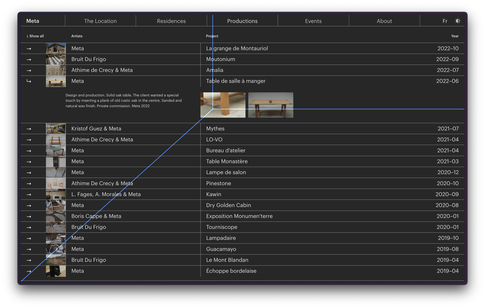
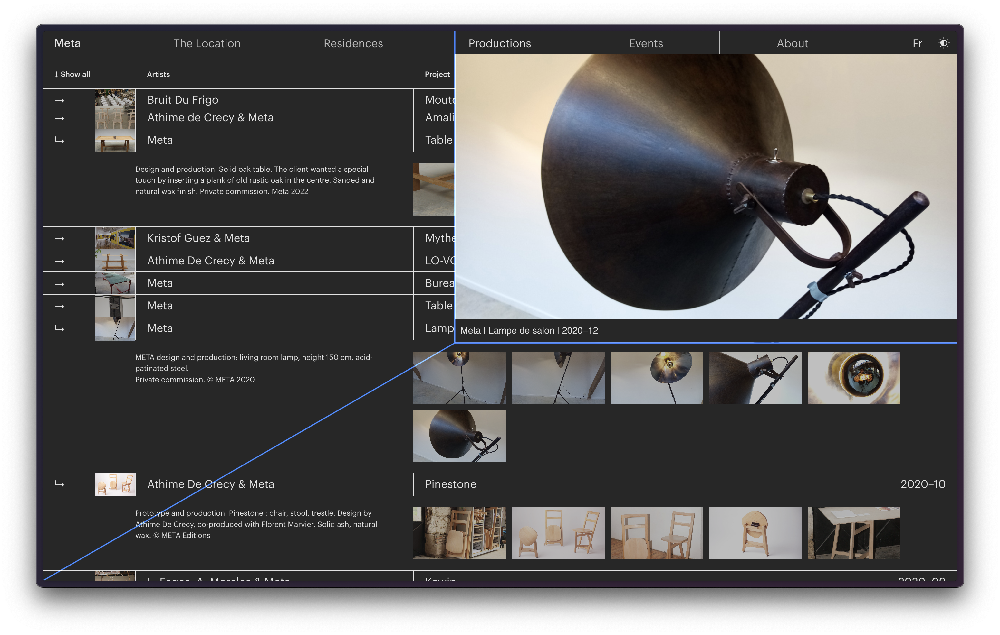
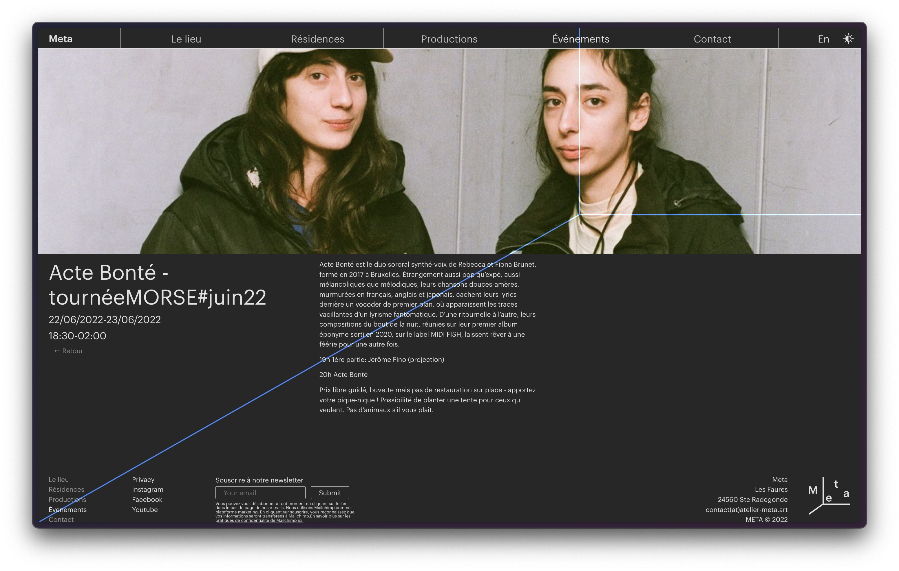
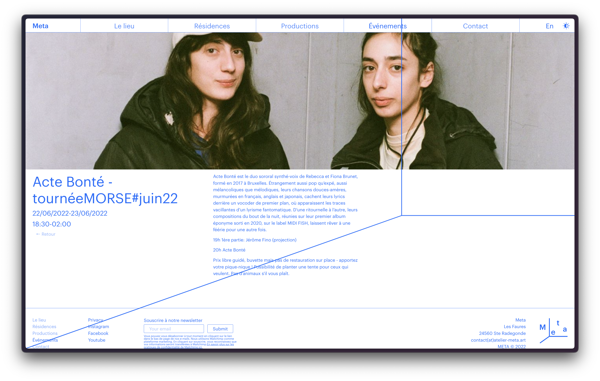

# Association Meta

Visit the website [here](https://www.atelier-meta.art).

## Introduction

The Association Meta is dedicated to design, production, prototyping, aesthetic research, and creation assistance. It offers a decentralized space for visual and contemporary art. Notably, the association's visual identity was developed by the creator in 2020, prior to Facebook's rebranding to Meta. The website marks a significant milestone for the association, allowing them to showcase their work and expand their reach online.

## Features

-   The website incorporates various features inspired by the association's identity and logo.
-   It utilizes the Cartesian Coordinate System for user interaction and image previewing.

## Technologies Used

-   JavaScript
-   CSS
-   React
-   GraphQL
-   Contentful API
-   SWR
-   Netlify

## Multilingual Support

The website supports content in both French and English.

## Content Management

Content is managed and delivered using the Contentful API.

## Data Handling

The SWR library is used for data fetching and caching.

## Hosting

The website is hosted on Netlify.

## Creator

The website was designed and developed by Klaus Stille in 2022.
