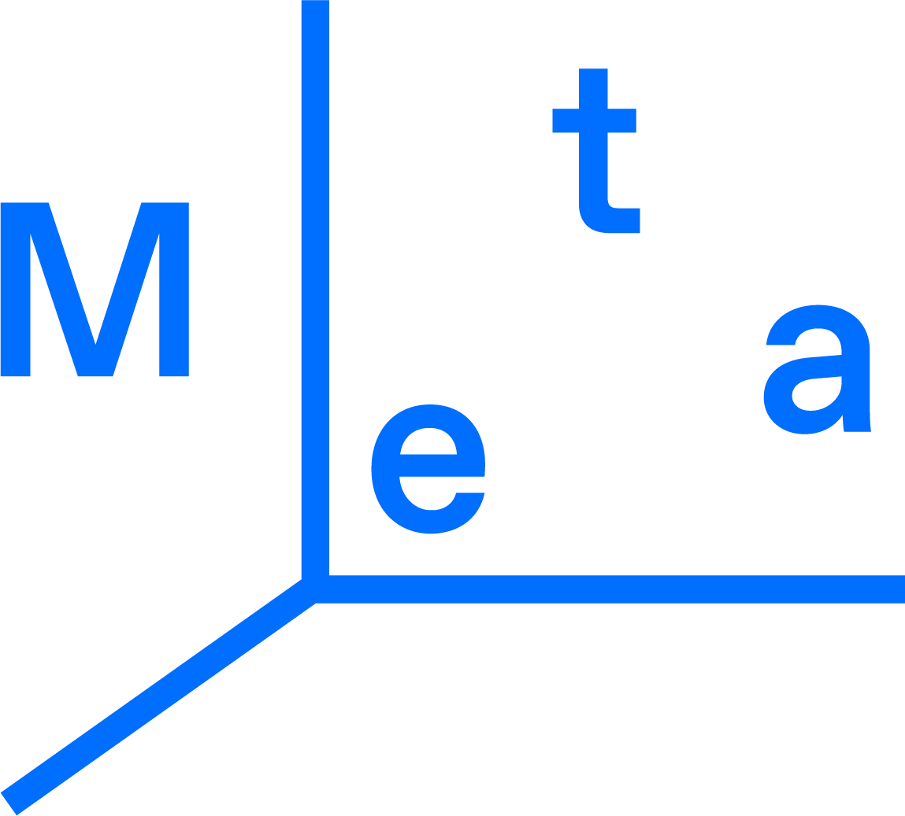

# Association Meta



## Running the project

First, run the development server:

```bash
npm run start
```

Open [http://localhost:3000](http://localhost:3000) with your browser to see the result.

Or visit the page here:
[https://www.atelier-meta.art](https://www.atelier-meta.art)

## Overview

This page was created for an association that provides a space for design, production, prototyping, aesthetic research and creation assistance. The goal of this artistic structure is to offer a decentralized space dedicated to visual and contemporary art. The association's visual identity was also designed by the developer in 2020 (before Facebook changed its company name to Meta...). This website represents a new milestone for the association, providing them with an online presence to showcase their work and reach a wider audience.

## Features

The application has several features based on the association's identity and logotype. The Cartesian Coordinate System serves as a base for user interaction and as a container for previewing images.

## Technologies

-   Javascript
-   CSS
-   React
-   GraphQL
-   Contentful API
-   SWR
-   Netlify

The application supports multilingual content and renders in both French and English. The project utilizes the Contentful API to manage and deliver content, and uses the SWR library to handle data fetching and caching. The application is hosted on Netlify.

## Made by

This page was designed and developed by Klaus Stille in 2022.

## Preview

### Main


### Atelier


### Productions


